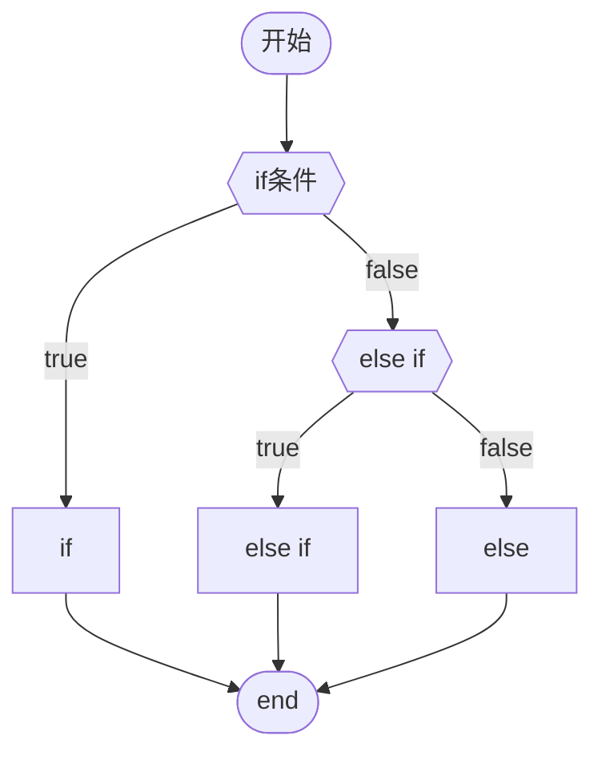
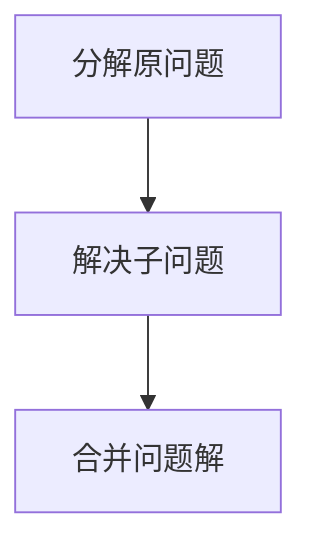
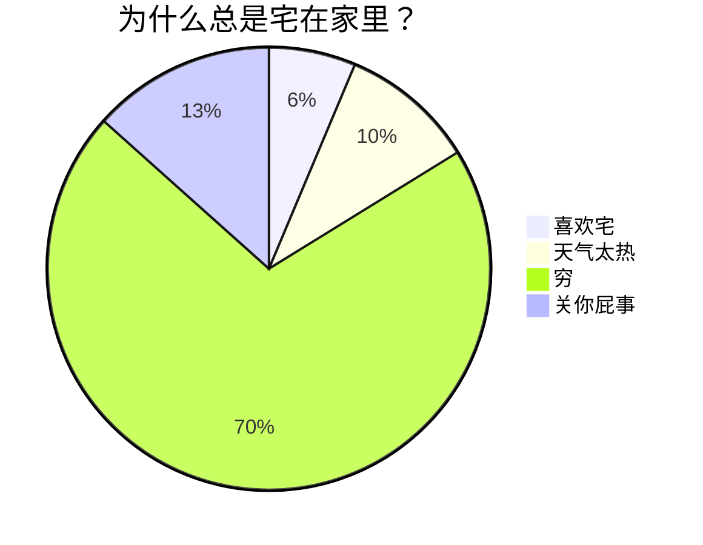
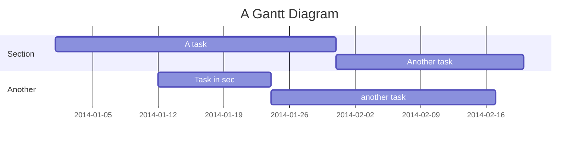

# Typora基本语法

### 删除线
```markdown
这是~~删除线~~(使用波浪号)
```
这是~~删除线~~


### 斜体
```markdown
这是*斜体*文本
```
这是*斜体*文本


### 加粗
```markdown
这是**加粗**文本
```
这是**加粗**文本


### 斜体+加粗
```markdown
这是***斜体+加粗***
```
这是***斜体+加粗***


### 下划线
```markdown
下划线<u>下划线</u>
```
这是<u>下划线</u>
`HTML语法`


### 高亮
```markdown
这是==高亮==文本
```
这是==高亮==文本


### 下标
```markdown
水H~2~O
```
H~2~O

### 上标

```
10^16^
```

10^16^

### 表情
```markdown
:smile: :laughing: :cry:
```
:smile::laughing::cry:


### 引用
```markdown
>用右尖括号引用
```
>引用
>>引用里嵌套引用
>>emmm


## 列表
### 无序列表--符号 空格
```markdown
* 可以使用`*`作为标记
+ 也可以使用`+`
- 或者`-`
```
* 可以使用`*`
+ 也可以`+`
- 或者`-`

### 有序列表--数字`.`空格
```markdown
1. 有序列表以数字和`.`开始
2. 数字的序列并不会影响生成的列表序列
3. 但仍然按照自然顺序（1.2.3...）编写。
```
1. 有序列表以数字和`.`开始
2. 数字的序列并不会影响生成的列表序列
3. 但仍然按照自然顺序（1.2.3...）编写。

## 代码
### 代码块
```java
This is Java
```
### 行内代码
`啦啦啦`
### 分隔线
在一行中使用三个或多个`*`或`_`来添加分隔线
____
```markdown
***
____
```

## 跳转

### 外部跳转--超链接
格式为 `[link text](link)`
```markdown
[帮助文档](https://www.bilibili.com/)
```
[帮助文档](https://www.bilibili.com/)

### 内部跳转--本文件内跳
格式为`[link text](#要去的标题)`
```markdown
[我想跳转到](#代码)
```
[我想跳转到](#代码)

### 自动链接
使用`<>`包括的URL或邮箱地址会被自动转换为超链接：
```autolink
<https://www.bilibili.com/>
```
<https://www.bilibili.com/>

### 图片
```markdown

```

   


### 高级

#### 公式
$x^2 + 2x + 5 + \sqrt x = 0$

$\ce{CO2 + C -> 2 CO}$

$\ce{2Mg + O2 ->[燃烧] 2 MgO}$

#### 流程图






#### 饼状图




这里有&nbsp;&nbsp;&nbsp;&nbsp;&nbsp;&nbsp;6个空格分隔


