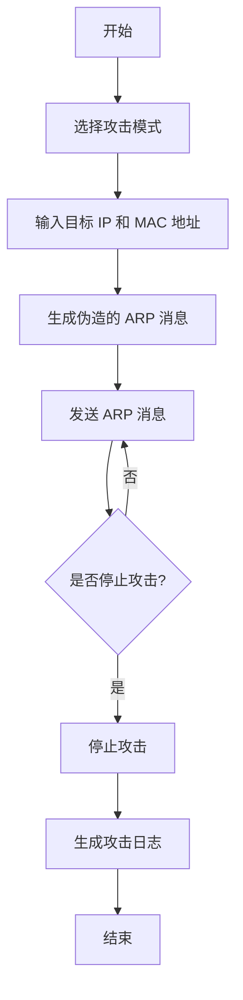

# 网络  
## TCP/IP 面试题  
[TCP/IP协议常见面试题](https://blog.csdn.net/qq_41696018/article/details/124249818)
[计算机TCP/IP面试10连问，你能顶住几道?](https://zhuanlan.zhihu.com/p/357930679)  
[TCP/IP计算机网络协议面试题汇总](https://zhuanlan.zhihu.com/p/624875367) ***
  
  
## http 协议面试题  
[100% 的面试官都会问的HTTP面试题](https://zhuanlan.zhihu.com/p/135947893)  
[硬核！30 张图解 HTTP 常见的面试题](https://zhuanlan.zhihu.com/p/112010468)    
  
  
## OSPF 路由协议        
        
video: [十分钟理解OSPF路由协议 路由技术基础](https://www.bilibili.com/video/BV1YV41127U5/)
  
因为 RIP 协议的缺陷，所以采用 OSPF 协议  

RIP 与 OSPF 比较：  
RIP：  
* 距离矢量路由协议
* 基于跳数选择最优路径
* 每隔30s 向邻居传播自己的整个 RIP 路由表
OSPF：  
* 链路状态路由协议
* 基于链路开销选择最优路径
* 出发更新或每隔30分钟向邻接路由器发送链路状态信息的摘要，增量更新机制    
  
RIP 协议缺陷：  
	1. 以跳数评估的路由并非最优路径
	2. 最大条数15，导致网络规模小
	3. 更新发送全部 RIP 路由表浪费网络资源
	4. 收敛速度慢  
  
<<<<<<< HEAD
### OSPF 协议工作过程：      
    
1.发现邻居    
2.建立邻接关系    
	只有建立邻接关系的邻居路由器才会交换链路状态信息
	不是跟所有邻居都建立邻接关系
	在网络中选举 DR 和 BDR，网络所有路由器只与 DR 和 BDR 建立邻接关系
	广播型网络中一般会选举 DR 和 BDR，PPP 网络中不会选举 DR 和 BDR  
3.传递链路状态信息    
    
    
    
  
4.路径计算  
      

OSPF 分区域管理    
    
    

  
  
# 快问快答  
  
TCP 和 UDP 的区别？  
使用 VLAN 的好处？  
RAID0, RAID1, RAID3, RAID5 的区别？  
说说网络层、传输层、数据链路层是做什么的，以及之间的关系？  
STP、RSTP、MSTP 的区别？  
OSPF 协议，邻接表  

  

# Linux  
## 小问答  
- 关闭Linux系统不重启用什么命令
  关机 shutdown -h
  重启 shutdown -s
- 数据库备份如何使用？
  mysqldump
- 压缩文件如何创建和解压？
  tar
  -x gz
  -j bzip2
  -J xz
- 常见的端口Web服务和数据库
  3306 mysql
  1433 sqlserver
  6379 redis
  1521 oracle
  21 22 23 ftp ssh telnet
  873 rsync
  3389   
- 常见的linux日志文件和路径
- 常见的进程管理命令
- 内核子系统有哪些？操作系统的主要功能？
  五个内核子系统  1进程调度系统  2虚拟文件系统  3内存管理单元  4网络单元  5进程间通信
  操作系统主要功能  1处理机管理  2存储管理  3设备管理  4文件管理  5作业管理
- 系统的运行级别，默认的运行级别是？
  运行级别0-6  
- 虚拟化，完全虚拟化，半虚拟化，docker
- docker常用命令，例如开启所有容器，删除所有镜像，复制文件到容器内
- 写一个脚本，每5分钟判断一次SSH登陆失败超过10次的IP
- 解释一下什么是分布式部署，负载均衡，反向代理
- 对云原生的理解
  
    
### Docker 容器有几种状态？

- starting 运行状态
- Exited 退出状态
- Paused 暂停状态
- healthy 健康状态
- unhealthy 非健康状态  
  
  
  
  

graph TD
    A[开始] --> B[选择攻击模式]
    B --> C[输入目标 IP 和 MAC 地址]
    C --> D[生成伪造的 ARP 消息]
    D --> E[发送 ARP 消息]
    E --> F{是否停止攻击?}
    F -- 否 --> E
    F -- 是 --> G[停止攻击]
    G --> H[生成攻击日志]
    H --> I[结束]
