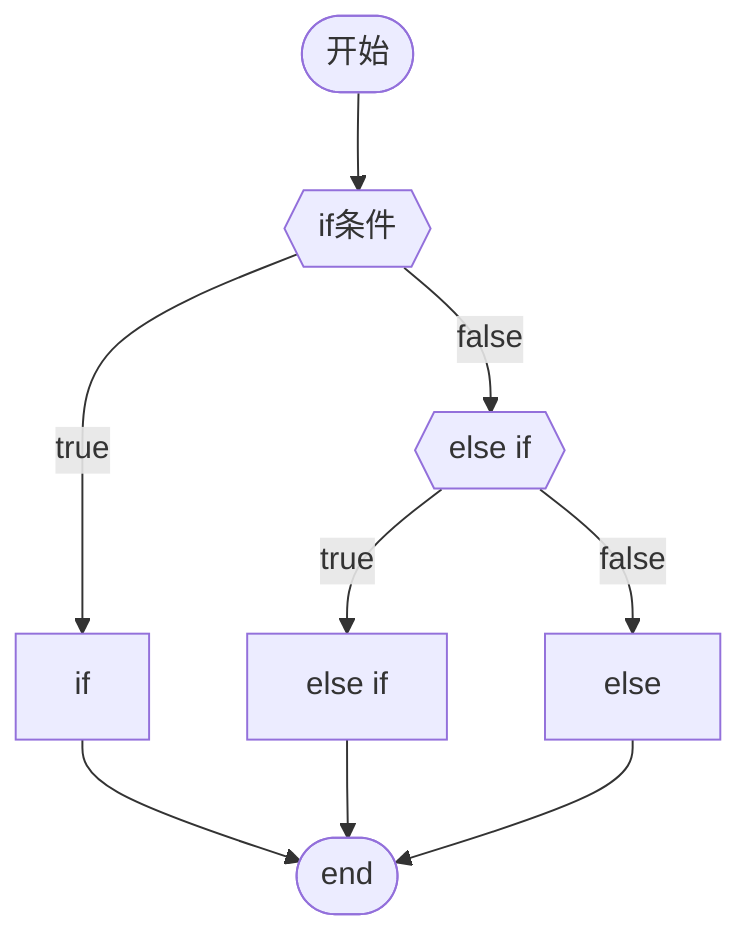
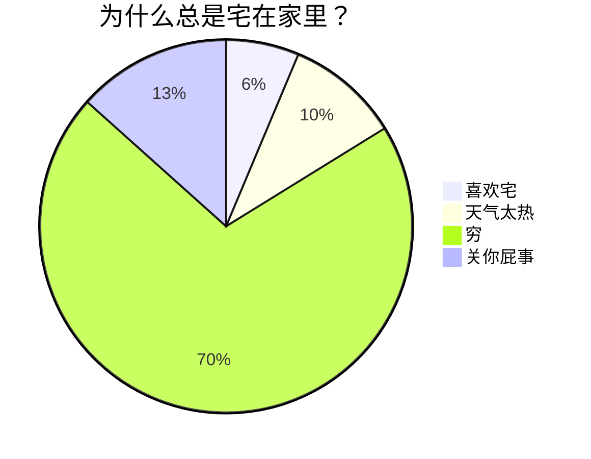
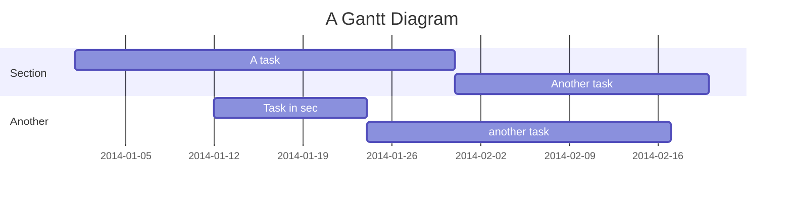
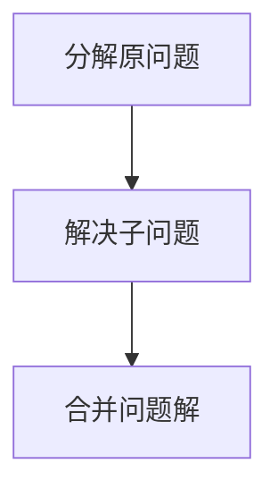

# 好用app/网站

文件传输：localsend

ssh连接：windterm

微软官方office白嫖：https://www.freedidi.com/6619.html

$x^2 + 2x + 5 + \sqrt x = 0$

$\ce{CO2 + C -> 2 CO}$

$\ce{2Mg + O2 ->[燃烧] 2 MgO}$

这里有&nbsp;&nbsp;&nbsp;&nbsp;&nbsp;&nbsp;6个空格分隔

