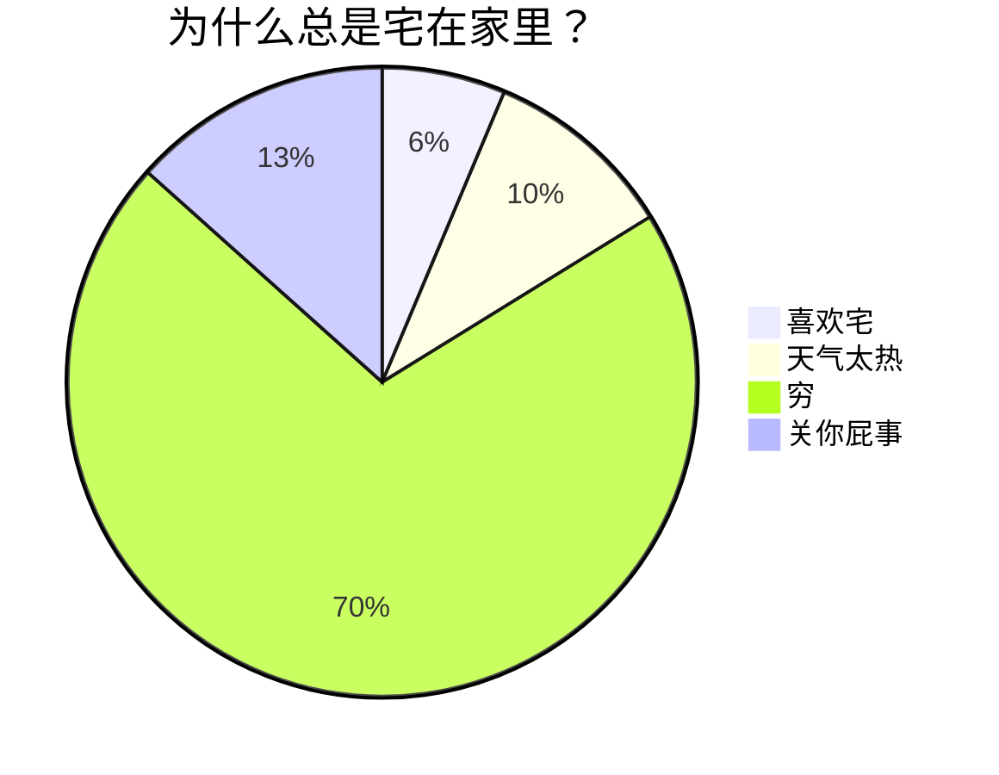
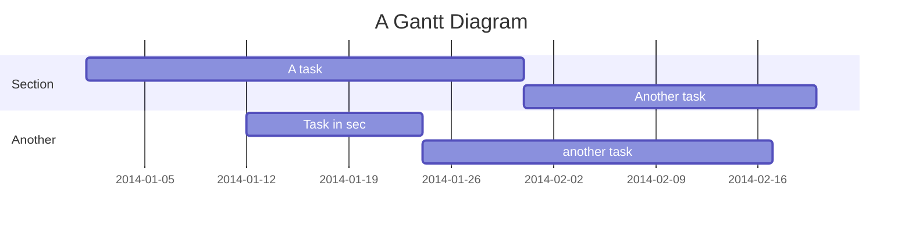
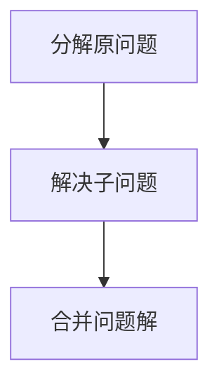

  


# 好用app/网站

文件传输：localsend

微软官方office白嫖：https://www.freedidi.com/6619.html


$x^2 + 2x + 5 + \sqrt x = 0$

$\ce{CO2 + C -> 2 CO}$

$\ce{2Mg + O2 ->[燃烧] 2 MgO}$






这里有&nbsp;&nbsp;&nbsp;&nbsp;&nbsp;&nbsp;6个空格分隔





## pyside6

piside6将ui文件转化成py文件命令：
```
pyside6-uic widget.ui > ui_widget.py
```
然后转换编码


ChatNextWeb

```
sudo docker pull yidadaa/chatgpt-next-web

sudo docker run -d -p 13000:3000 -e OPENAI_API_KEY="API-KEY" -e BASE_URL=https://api.chatanywhere.com.cn yidadaa/chatgpt-next-web
```


  
  
# 零星知识点  
  
## redis 
### 缓存穿透：    

指查询一个一定不存在的数据，由于缓存是不命中时需要从数据库查询，查不到数据则不写入缓存，这将导致这个不存在的数据每次请求都要到数据库去查询，进而给数据库带来压力。  
缓存穿透一般都是这几种情况产生的：

- **业务不合理的设计**，比如大多数用户都没开守护，但是你的每个请求都去缓存，查询某个userid查询有没有守护。
- **业务/运维/开发失误的操作**，比如缓存和数据库的数据都被误删除了。
- **黑客非法请求攻击**，比如黑客故意捏造大量非法请求，以读取不存在的业务数据。

**如何避免缓存穿透呢？** 一般有三种方法。

- 1.如果是非法请求，我们在API入口，对参数进行校验，过滤非法值。
- 2.如果查询数据库为空，我们可以给缓存设置个空值，或者默认值。但是如有有写请求进来的话，需要更新缓存哈，以保证缓存一致性，同时，最后给缓存设置适当的过期时间。（业务上比较常用，简单有效）
- 3.使用[布隆过滤器](https://zhida.zhihu.com/search?q=%E5%B8%83%E9%9A%86%E8%BF%87%E6%BB%A4%E5%99%A8&zhida_source=entity&is_preview=1)快速判断数据是否存在。即一个查询请求过来时，先通过布隆过滤器判断值是否存在，存在才继续往下查。
  
    
### 缓存雪奔 ：   
指缓存中数据大批量到过期时间，而查询数据量巨大，请求都直接访问数据库，引起数据库压力过大甚至down机。

- 缓存雪奔一般是由于大量数据同时过期造成的，对于这个原因，可通过均匀设置过期时间解决，即让过期时间相对离散一点。如采用一个较大固定值+一个较小的随机值，5小时+0到1800秒酱紫。
- Redis 故障宕机也可能引起缓存雪奔。这就需要构造Redis高可用集群啦。
  

### 缓存击穿 ：   
指热点key在某个时间点过期的时候，而恰好在这个时间点对这个Key有大量的并发请求过来，从而大量的请求打到db。

缓存击穿看着有点像，其实它两区别是，缓存雪奔是指数据库压力过大甚至down机，缓存击穿只是大量并发请求到了DB数据库层面。可以认为击穿是缓存雪奔的一个子集吧。有些文章认为它俩区别，是区别在于击穿针对某一热点key缓存，雪奔则是很多key。

解决方案就有两种：

- **1.使用[互斥锁](https://zhida.zhihu.com/search?q=%E4%BA%92%E6%96%A5%E9%94%81&zhida_source=entity&is_preview=1)方案**。缓存失效时，不是立即去加载db数据，而是先使用某些带成功返回的[原子操作](https://zhida.zhihu.com/search?q=%E5%8E%9F%E5%AD%90%E6%93%8D%E4%BD%9C&zhida_source=entity&is_preview=1)命令，如(Redis的setnx）去操作，成功的时候，再去加载db数据库数据和设置缓存。否则就去重试获取缓存。
- **2. “永不过期”**，是指没有设置过期时间，但是热点数据快要过期时，异步线程去更新和设置过期时间。  
  
### 热key  
  
**什么是热Key呢**？在Redis中，我们把访问频率高的key，称为热点key。    
  
  
  
  
  
# 字符编码和二进制的关系  
  
> - ascii 编码，256
  
  
  
