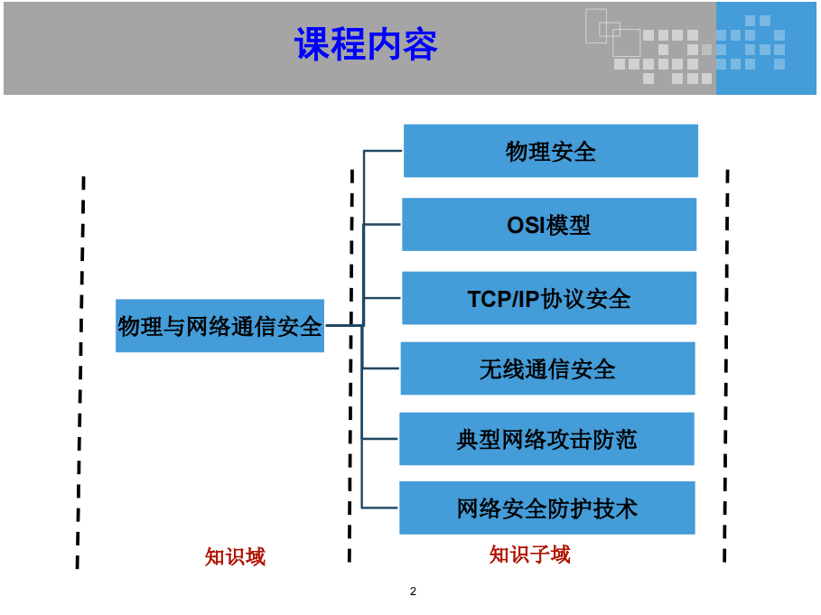
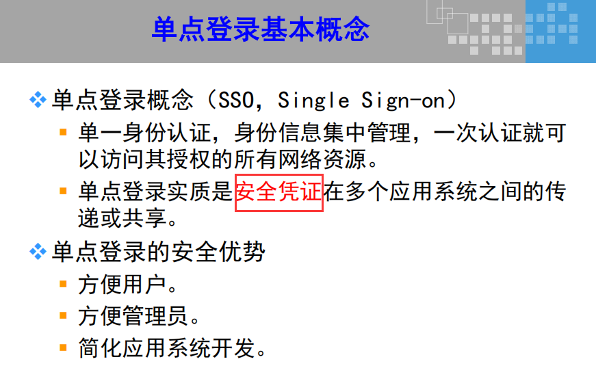
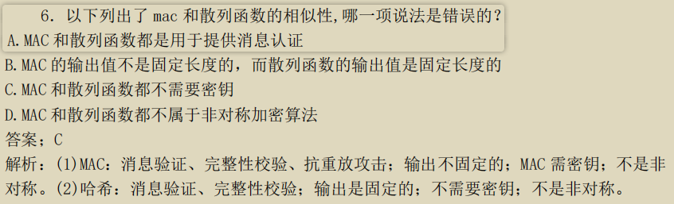

# 信息安全保障

信息：有意义（有价值）、无形

控制措施类型：技术、管理、物理

控制措施作用：
	威慑性
	预防性
	检测性
	纠正性
	恢复性
	补偿性

​	DRP灾难恢复计划：预防性

IATF：深度防御，串行

安全属性：**CIA**
	**保密性**：防止信息泄露
	**完整性**：防止未授权的篡改、防止越权篡改、保证内/外部信息一致性
	**可用性**：保证信息资产对授权主体随时有效高效的访问

其他属性：
	真实性：保证内容真实、保证来源真实
	可问责性：最高管理层对信息安全负有最终的责任
	不可否认性：抗抵赖
	可靠性：保证信息资产在特定条件或特定时间段内的可用性

信息安全：保护组织有价值的信息资产（软件、硬件、服务、知识产权、人员等）

安全责任：
	责任：responsibility
	问责：accountability
	责任、义务：liability

管理：为了实现既定的目标而采取一系列活动的集合

信息安全管理：为了实现信息安全目标而采取一系列活动的集合

制定信息安全目标依据：合规性、业务系统使命、风险评估

信息安全管理体系：遵从PDCA循环、方针政策

信息安全组织结构：
	决策层：制定方针政策、提供各种资源、分配职责、重大事件的决策、为信息安全负最终的责任
	管理层：
	支撑层：
	安全层：
	用户层：
	审计（独立的过程）

信息的销毁：信息是否被正确的销毁（符合组织的废弃制度）、信息是否被真正的销毁（不可恢复）

数据错误：错误的频率、错误的严重程度

信息安全问题：
	信息安全根本目标：保障业务连续性
	决策层的支持是信息安全成功与否的关键因素
	考虑成本
	适度安全
	自上而下运行
	……

信息安全根源：
	内因：漏洞
	外因：威胁
		环境：狂风暴雨、泥石流、火灾、水灾等
		人为：恶意（制作病毒、传播恶意代码、恶意攻击）和非恶意（失误和错误）

信息安全形成：外因成功利用漏洞

安全视角：
	国家：cyber space security网络空间安全
		网络战
		关键基础设施保护
		合规性和标准化
	企业视角：
		业务连续性
		资产保护
		合规性格
	个人视角：
		隐私保护
		社会工程学
		个人资产安全

信息安全区文档化：
	战略：方针政策（中长期：3-5年）
	战术：标准（内部制度、规范等）、指南（国家标准国际标准等）、基线、程序

应对社会工程学最有效的方式：安全意识培训
检查安全意识培训效果：人员行为的改变

安全意识培训：内容新、形式多种多样

下面哪种方式应对垃圾搜寻最有效：
    A:购买碎纸机
    B:安装CCTV
    c:安全意识培训
    D:员工发信息安全邮件
  C

下面哪个对于意识培训最有效:
    A:员工发信息安全邮件
    B:绩效
    C:多种宣传方式
    D:内容新颖
  B

信息安全：制定安全策略、实现安全策略、安全评估

信息安全支持认证和认可：
	认证：确保系统、产品或网络能够满足用户的要求
	认可：管理层对系统总体安全和功能的充分性正式接受

访问控制模型：状态机模型、多格子模型、信息流模型、无干扰模型等

内存：段式保护、页式保护、段页式保护、进程隔离等

PDR：基于时间的静态被动模型，Pt>Dt+Rt,S就是安全的（时间难于确认）
PDR没有考虑人的因素

PPDR：动态主动防护模型，所有的PDR都是基于policy的

PPDRR：policy, protection, detection, response, recovery

**IATF：信息保障技术框架
	核心思想：深度防御
	三个要素：人、技术、操作
	四个焦点领域：
		防护本地计算环境
		防护区域边界
		防护网络基础设施
		支撑性基础设施**

信息系统安全保障评估框架-评估模型：

信息系统生命周期：需求、设计、实施交付、运营、废弃

保障四要素：技术、管理、工程、人员

安全属性：CIA（机密性、完整性、可用性）

威胁建模：STRIDE

CMM：5个级：初始级、重复级、定义级、管理级、优化级

ISPP：信息系统保护轮廓	information system protection profile

ISST：信息系统安全目标	information system security target

# 信息安全管理

### 信息安全风险管理策略涉及内容：

信息安全风险的目标
组织可接受的风险水平和定义
风险识别的正式的流程
信息系统风险管理策略和组织战略规划过程之间的联系
定义信息安全管理角色与职责
风险和内部控制之间的对应关系
为相应风险分析而改变员工行为和资源分配的方法
风险与绩效目标和成本之间的对应关系
持续检测安全控制措施有效性的主要指标

### 风险管理：

#### 风险：

时间发生的概率和影响的组合

风险：指外部的威胁（黑客）利用系统自身的脆弱性作用资产，产生风险

#### 风险管理的价值

风险管理的价值是
安全措施的成本与资产价值之间的平衡

**基于风险的思想是所有信息系统安全保障工作的核心思想！**

#### 风险管理的三个层面：（NIST SP800-39）
组织层面
业务流程层面
信息系统层面

#### 风险管理流程：（NIST SP800-39）
风险框架
风险评估
风险响应
风险检测

#### 风险评估和风险处理
风险评估: 所有信息安全事件的起点和基础,包括风险识别和评估风险
风险处理: 所有信息安全事件的核心

### *GB/Z24364 《信息安全风险管理指南》

#### 四个阶段：

##### 背景建立：
准备（对象，团队，计划，获得支持），系统调查，系统分析，安全分析（要求，环境）
##### 风险评估： 

风险评估:所有信息安全事件的起点和基础,包括风险识别和评估风险

准备（计划，方案，方法和工具），要素识别（资产、威胁，脆弱性，已有的控制措施），分析（可能性和影响），结果判定（风险等级：非常高，高，中，低）

##### 风险处理：

风险处理:所有信息安全事件的核心

规避：ftp服务关闭
降低：加固，安全设备
转移：第三方，保险
接受：领导签字确认
##### 批准监督：
**批准：**是指机构的决策层依据风险评估和风险处理的结果是否满足信息系统的安全要求，做出是否认可风险管理活动的决定

**监督：**是指检查机构及其信息系统以及信息安全相关的环境有无变化，监督变化因素是否有可能引入新风险

沟通咨询：交流、表态、指导、报告等

场景：A是某金融组织的安全从业人员，某天审计团队要求A出示相关的审计材料，问A出示或者不出示？	No

监控审查:
	监控过程有效性、监控成本有效性
	审查结果有效性和符合性

ISMS评审:
	内部评审:ISMS小组内部审核
	管理评审:组织管理层实施的评审

### 一、管理标准（PDCA）

ISO27001：BS7799-1(英国)：ISMS要求
P：PLAN：计划。领导力
D：DO：实施。制定风险处置计划，实施培训
C：CHECK：检测。内部审核，管理评审：都是内部发起的，不是外部的。
A：ACT：改进/行动。

PPDR模型核心思想
所有的防护、检测、响应都是依据安全策略实施

ISO27003：ISMS实施指南

ISO27004：度量

ISO27005：风险管理指南

ISO27002：ISO17799——BS7799-1管理实施准则--最佳实践
	~~2005版：**[11个方面](https://wenku.baidu.com/view/d264ed9d6bec0975f465e22a.html?_wkts_=1671601168930)**，39控制目标，133控制措施~~
	~~2013版：**14个方面**，通信安全，操作安全，密码学，供应商关系，35控制目标~~

### 二、制定风险处置计划：DO

### 三、文档化

一级：方针

二级：程序

三级：指南

四级：日志，记录

一级文件和二级文件需要发布出去        

### 四、最佳实践：

ISO27002：ISO17799——BS7799-1

### 安全控制措施内部结构

14个类别：

#### 1. 信息安全方针：

陈述管理层意图

业务战略，你要做什么，没有怎么实现

不包括：详细的技术方案，设备选型

评审：业务发生重大变化

#### 2. 信息安全组织：

明确职责

管理层：指导，协调，批准

安全管理员：执行层

业务安全负责：业务所有者

对内：和各个部门联系，保密协议：与人数无关

*对外：识别外部各方的风险，合同中约定

移动设备：锁

远程办公：VPN：数字化转型

#### 3. 人力资源安全：

任用前：背景调查-财务总监(√) 技术(×)

任用中：意识教育，培训，奖励和惩罚

任用终止和变化：禁用账户，回收权限，改密码，销毁门禁卡等
（各种卡复制：proxmark5.0）
（0-15个磁道：第3个：金额，加密算法：卡号，身份号，xor）

没有任用后

#### 4. 资产管理：

按敏感度、法律法规和价值分类
	军方：绝密，机密，秘密

a.对资产负责：资产负责人

b.信息分类：信息适当级别的保护
	分类指南，标记，处理

c.介质：消磁，格式化，低格，物理破坏
审计人员：以下哪个操作，你是最关注的？
	格式化：易恢复
	硬盘：0磁道
	负磁道：固件，pc3000，hrt

#### 5. 访问控制：防非授权访问

DAC：自主访问控制，灵活，由所有者决定

MAC：强制访问控制：不灵活，由管理员和操作系统来决定，基于敏感标签：文件：绝密， 用户：绝密级

RBAC：基于角色，权限控制
   group1：权限

a.用户管理：
   唯一性，权限：最小
   审计：审核
   特殊权限管理：权限的权限
   禁用账户被克隆：guest——>administrator
   	1f4和1f5的F值是否相同
   检测超级隐藏账户：用户里面看不到

   ps：
   职责分离：运维人员不能访问源码，如无法实现，加强审计
   强制休假：审计
   岗位轮换：
   授权蔓延：一个人由一个岗位变化到另一个岗位，原权限没有回收，权限累加

b.系统和应用：

   口令管理：长度，复杂度

#### 6. 密码学：

保证 机密性、完整性、抗抵赖

https: cipher suite：算法套件
	ecdhe-rsa-aes-sha256

密钥管理：

#### 7. 物理和环境安全：

湿度太高：腐蚀，短路

湿度太低：静电

灭火：七氟丙烷

同一机房内：不能同时放二氧化碳和哈龙：容易引起人的窒息

湿管：管道里一直有水，冻，漏

干管：管道没有水

机房分：A，B，C

选址：除顶楼、地下、一楼之外

tempest：电磁防泄漏，出标准的是国家保密局，标准：BMB

CCTV：闭路电视：
	摄像头：检测级、识别级、确认级
	设备：锁——延迟
	门禁卡，识别卡，陪同参观：最安全

#### 8. 操作安全：

正确，安全

变更管理：签字确认，记录

容量管理：

恶意代码：定时更新病毒库，软件来源

备份：勒索：隔离备份，备份方案：测试备份数据的有效性，

日志：系统、应用日志

操作软件控制：正规

漏洞管理：

#### 9.通信安全：

a.网络安全：

​	ipsec, gre vpn:

​	tls, ssl vpn

b.信息安全交换：加密手段，协议规定

#### 10.信息系统的获取开发及维护开发：

输入检验：合法，白名单，0-9a-z

第三方：可靠评价

#### 11.供应商关系：

确保供应商可访问的组织资产受到保护

供应商关系的信息安全方针、供应商协议中解决安全问题、信息和通信技术的供应链

sla：服务水平协议

#### 12.信息安全事件管理：

应急响应：

cisp-ire：应急响应

#### 13.业务连续性管理：

bia：业务影响分析：对关键业务做

冗余：

链路冗余

设备冗余

#### 14.符合性：

法律法规符合

策略方针和标准符合

审核结果符合：自动化工具，渗透测试，IS审计

# 物理与网络通信安全

## OSI 七层模型

### ISO/OSI 七层模型结构

## TCP/IP 协议

### OSI模型与TCP/IP协议的对应

### TCP/IP 协议族结构

。

## 网络安全防护技术

### 数据检测技术

### 入侵检测的局限性

## IPsec 协议

# 计算机环境安全

操作系统安全机制：

标识与鉴别、访问控制、权限管理、信道保护、安全审计、内存存取、文件保护等安全机制

操作系统安全配置：

安全补丁、最小化部署、远程访问控制、账户及口令策略、安全审计

第一个信息安全标准：

1985年美国《美国可信计算机系统评估准则》（桔皮书）**TCSEC**

四个大类七个小级

四个大类：DCBA		d  c2,c1  b3,b2,b1 a  c2商用

### SID/UID

# 信息安全支撑技术

### 单点登录的基本概念

## MAC消息认证码/消息鉴别码

### Kerberos体系构成

# tmp

对IS一般控制的审计：服务管理、IT外包审计、业务数据完整性审计等

对IS应用控制的审计：输入控制、处理控制、输出控制

演习目的：
	1.测试预案的有效性
	2.明确职责
	3.测试各部门之间的配合

决定是否报警：
	1.执法机关有强大的调查能力
	2.一旦设计执法，公司对于调查将失去控制权
	3.事故缘由可能公之于众
	4.考虑事件对组织的声誉的影响
	5.证据被收集起来以后，很长时间不能使用

计算机犯罪MOM：
	动机：Motive
	机会：Opportunity
	手段：Means

调查类型：行政调查、刑事调查、民事调查、监管调查

计算机取证的原则：
	合法原则
	充分授权原则
	优先保护证据原则
	全程监督原则

**计算机取证的流程：**
	**准备**
	**保护**
	**提取**
	**分析**
	**提交**

**应急响应六阶段：**
	**准备**
	**检测**
	**遏制**
	**根治**
	**恢复**
	**跟踪总结**

SIEM: security information event manage

NIST sp800-61: 《计算机安全事故处理指南》，指出了报告事故包含的信息：
	事故的摘要
	指标
	关联事故
	采取的行动
	如果涉及到取证：所有证据的监管链
	影响的评估
	事故处理者的身份和意见
	接下来采取的措施

存储技术：
	DAS：直接附加存储
	SAN：存储区域网络
	NAS：网络附加存储

备份技术：
	完全备份
	增量备份
	差异备份

RAID：冗余磁盘阵列
	RAID-0（条带）：提高了磁盘子系统的性能，但不提供容错能力
	RAID-1（镜像）：磁盘一对一镜像，确保数据不丢失
	RAID-5（奇偶校验）：三块以上磁盘，其中一块作为校验信息，允许第一磁盘损坏

灾难备份能力0~6级
	0级：无异地备份
	1级：简单异地备份
	2级：热备中心备份
	3级：电子传输备份
	4级：自动定时备份
	5级：实时数据备份
	6级：数据零丢失

6个灾难恢复等级
	第1级 基本支持
	第2级 备用场地支持
	第3级 电子传输和部分设备支持
	第4级 电子传输及完整设备支持
	第5级 实时数据传输及完整设备支持
	第6级 数据零丢失和远程集群支持

容灾技术：
	数据容灾（首要前提）
	系统容灾（基本基础）
	应用容灾（主要关键）

灾难恢复规划四个阶段：
	灾难恢复需求分析
	灾难恢复策略制定
	灾难恢复策略实现
	灾难恢复预案的制定和管理

灾难恢复预案制定和管理
	制定灾难恢复预案
	灾难恢复计划的教育与培训
	灾难恢复计划演习
	灾难恢复预案的保存与分发

本章重点：应急和灾备

# 零碎笔记

CC：《信息技术安全通用评估准则》

CC的优势：
	通用
	灵活
	全面，兼容
	结构开放

CC的先进性体现在四个方面：
	结构的开放性
	表达方式的通用性
	结构和表达方式的内在完备性
	实用性

CC标准中的四个关键概念：
	TOE: 	评估对象
	PP:		保护轮廓
	ST: 		安全目标
	EAL: 	评估保证级

CC标准评估保证级共分为**7个**递增的评估保证等级

软件安全的三根支柱：
	应用风险管理：	策略性方法：
	接触点：	    一套轻量级最优工程化方法，攻击与防御综合考虑
	安全知识：	   强调对安全经验和专业技术进行收集汇总，对软件开发人员进行培训，并通过安全接触点实际运用
其强调了在软件的整个生命周期中风险管理的重要性，并要求风险管理框架贯穿整个开发过程

IPSec协议包含两种模式：传输模式、隧道模式

数据封装是由上至下，数据解封是由下至上

配置MD5安全算法可以提供可靠的数据完整性校验

配置AES算法可以提供可靠的数据加密

电子取证包括：**准备**、**保护**、**提取**、**分析**、**提交**  五个方面

* A类地址范围：1.0.0.1到126.255.255.254

* B类地址范围：128.0.0.1到191.255.255.254

* C类地址范围：192.0.0.1到223.255.255.254

* A类私有地址范围：10.0.0.0到10.255.255.255

* B类私有地址范围：172.16.0.0到172.31.255.255

* C类私有地址范围：192.168.0.0到192.168.255.255

一级：自主保护级，不需要定级备案

二级：没有提及到国家层面，只有社会层面

三级：提及国家安全损害

四级：对国家安全造成严重损害

五级：对国家安全造成特别严重损害

等保二级每两年测评一次，三级每年进行一次，四级半年

系统安全工程能力成熟度模型（SSE-CMM）定义了
**评估威胁**、**评估脆弱性**、**评估影响** 及 **评估安全风险**
这四个过程

ACL由 DATA OWNER 管理

与 PDR 模型相比， P2DR 模型则更强调**控制和对抗**，既强调系统安全的**动态性**，并且以**安全检测**、**漏洞检测**和**自适应填充“安全间隙”**为循环来提高**网络安全**。

Kerberos协议是一种集中访问控制协议，它能在复杂的网络环境中，为用户提供安全的**单点登录**服务，单点登录是指用户在网络中进行一次身份认证，便可以访问其授权的所有网络资源，而不再需要其他的身份认证过程，实质是**安全凭证**在多个应用系统之间的传递或共享。

威胁建模是了解系统面临的安全威胁，确定威胁风险并通过适当的环节措施以降低风险，提高系统安全性的过程。包括：**确定对象**、**识别威胁**、**评估威胁**、**消减威胁**四个步骤。

信息安全事件的分类方法有很多种，依据GB/Z20986-2007《信息安全技术信息安全事件分类分级指南》，信息安全事件分7个基本类别：
	**有害程序事件**
	**网络攻击事件**
	**信息破坏事件**
	**信息内容安全事件**
	**设备设施故障**
	**灾难性事件**
	**其他信息安全事件**

P2DR模型：

对于IPv4，IPsec是可选的，对于IPv6，IPsec是强制实施的
IPsec协议提供对IP及其上层协议的保护
IPsec安全协议给出了封装安全载荷和鉴别头两种通信保护机制

SABSA 舍伍德模型，从安全角度定义了业务需求

数据备份按数据类型划分可以分为**系统数据备份**和**用户数据备份**

信息系统审计是指国家审计机关依法对被审计单位信息系统的真实性、合法性、效益性和安全性进行检查监督的活动

VPN和公共网络是逻辑隔离的关系，可以进行信息认证、身份认证，数据加密（例如：IPsec VPN）

完整的安全标识符（SID）包括用户和组的安全描述，48 比特的身份特权、修订版本和可变的验证值

用户对鉴别信息的操作，如更改密码等都通过一个以 **system** *权限* 运行的 *服务* “Security Accounts Manager”来实现

**分组密码**是在加密过程中将明文进行分组后再进行加密

**序列密码**又叫流密码对每一个字节进行加密

主体和客体是相对的概念，主体在一定情况下可以成为客体，客体也可以成为主体。

信息安全特征：
	系统的安全
	动态的安全
	无边界的安全
	非传统的安全

强制访问控制比自主访问控制具有更高的安全性，**能有效防范特洛伊木马**，也可以防止在用户无意或不负责任的操作时泄露机密信息，适用于专用或安全性要求较高的系统。

在windows XP中用事件查看器查看日志文件，可看到的日志包括
	应用程序日志
	安全性日志
	系统日志
	IE日志

MAC需要密钥
哈希不需要密钥

Https 协议对传输的数据进行加密，可以避免嗅探等攻击行为

HTTPS 协议完全可以独立运行

AES 密钥长度由 128 位、192 位、256 位三种。

模糊测试本质上属于黑盒测试

Kerberos 由 MIT 于 1988 年开发，用于分布式环境中，完成**服务器与用户之间的相互认证**。

BLP模型严禁横向流通

Kerberos使用对称密码

使用静态口令方案时，即使对口令进行简单加密或哈希后进行传输，攻击者依然可能通过重放攻击来欺骗信息系统的身份认证模块

动态口令方案要求其口令不能被收集和预测

灾备工作原则包括**统筹规划**、**资源共享**、**平战结合**

组织第一次建立业务连续性计划时，最为重要的活动是 **制定业务连续性策略**

白盒测试的具体优点是 其确定程序准确性成某程序的特定逻辑路径的状态

为某航空公司的订票系统设计业务连续性计划时，最适用于异地数据转移/备份的方法是：**热备中心配置**

通常情况下信息安全风险评估工具不包括环境评估工具

防火墙具有IP地址欺骗防护功能，IDS 不能防止IP地址欺骗

TCP和UDP都可以用来dos攻击

UDP 协议包头中包含了源端口号和目的端口号，因此 UDP 可通过端口号将数据包送达正确的程序

相比 TCP 协议，UDP 协议的系统开销更小，因此常用来传送如视频这一类高流量需求的应用数据

UDP 协议无流量控制，超时重发等机制。

网络层和应用层可以提供保密性、身份鉴别、完整性、抗抵赖、访问控制服务

Windows从哪个版本开始引入安全中心的概念？	WinXP SP2

信息安全需求报告依据：合规性、业务系统使命、风险
