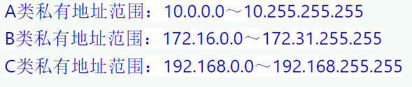

有关危害国际秘密安全的行为包括：
严重违反保密规定行为，定密不当、公共信息网络运营商及服务商不履行保密义务的行为、保密行政管理部门的工作人员的违法行为

A类、B类和C类IP地址中都可以设置私有地址

信息系统建设完成后，达到**二级以上**（不包括二级）的信息系统的运行使用各单位应当选择符合国家规定的测评机构，进行测评合格后方可投入使用。

属于或依附于传输层的安全协议是**SSL**

IPsec协议位于网络层

系统工程不是基本理论，耶不属于技术实现，而是一种方法论     （是理论不是 实现）

应急响应的六阶段为: 准备、检测、遏制、跟踪、恢复、跟踪总结

ISMS建设工作

电子取证包括:准备、保护、提取、分析、提交 五个方面进行

GB/T22239-2019《网络安全等级保护基本要求》

是规定了等级保护各个级别中的保护要求，按照技术和管理两个方面提出了相关基本安全要求

项目目标要遵守SMART原则，即项目的目标要求
具体(Specific)、
可测量(Measurable)、
需相关方的一致同意(Agreeto)、
现实(Realistic)、
有定的时限(Time-oriented)

GP适用于所有的PA活动

信息安全保障技术框架的一个核心思想是**深度防御**

