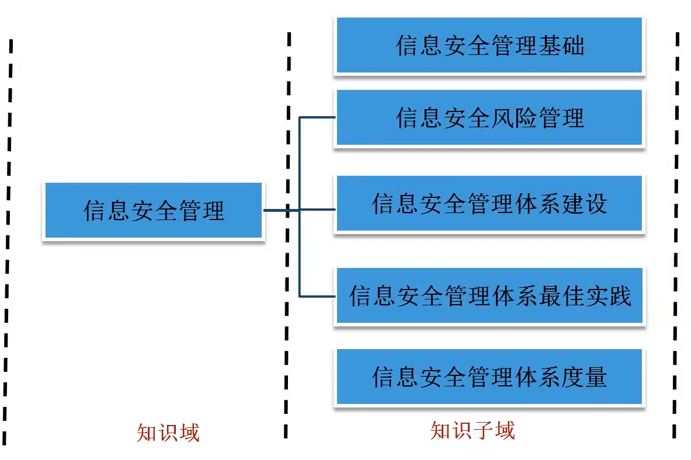

# 信息安全管理

### 一、管理以业务风险为核心

管理：高层支持

应急，DRP：测试  演练

### 二、木桶理论：

木板：防护措施

水：资产

短板：安全水平，安全意识不够
	admin:pass:md5
	log:明文

防护：面

攻击：点

个人隐私：大连：pipa隐私保护

### 三、风险管理

风险：指外部的威胁（黑客）利用系统自身的脆弱性作用资产，产生风险

漏洞扫描：识别脆弱性

### 四、风险管理的价值

风险管理的价值是
安全措施的成本与资产价值之间的平衡

**基于风险的思想是所有信息系统安全保障工作的核心思想！**

### 五、*GB/Z24364 《信息安全风险管理指南》

#### 四个阶段：
​	**背景建立：**准备（对象，团队，计划，获得支持），系统调查，系统分析，安全分析（要求，环境）
​	**风险评估：** 准备（指定方案，选择方法），要素识别（威胁，脆弱性，已有的控制措施），分析（可能性和影响），结果判定（风险等级：非常高，高，中，低）
​	**风险处理：**
​			规避：ftp服务关闭
​			降低：加固，安全设备
​			转移：第三方，保险
​			接受：领导签字确认
​	**批准监督**

#### 两个贯穿：
​	**监控审查：**保证信息安全风险管理主循环的有效性
​	**沟通咨询：**
​		与领导沟通，以得到理解和批准
​		单位内部各有关部门相互沟通，以得到理解和协作
​		与支持单位和系统用户沟通，以得到了解和支持
​		为所有层面的相关人员提供咨询和培训等，以提高人员的安全意识、知识和技能

风险评估阶段不需要部署控制措施

要选择最新，绝对，最恰当

### 一、管理标准（PDCA）

ISO27001：BS7799-1(英国)：ISMS要求
P：PLAN：计划。领导力
D：DO：实施。制定风险处置计划，实施培训
C：CHECK：检测。内部审核，管理评审：都是内部发起的，不是外部的。
A：ACT：改进/行动。

PPDR模型核心思想
所有的防护、检测、响应都是依据安全策略实施

ISO27003：ISMS实施指南

ISO27004：度量

ISO27005：风险管理指南

ISO27002：ISO17799——BS7799-1管理实施准则--最佳实践
	~~2005版：**[11个方面](https://wenku.baidu.com/view/d264ed9d6bec0975f465e22a.html?_wkts_=1671601168930)**，39控制目标，133控制措施~~
	~~2013版：**14个方面**，通信安全，操作安全，密码学，供应商关系，35控制目标~~

### 二、制定风险处置计划：DO

### 三、文档化

一级：方针

二级：程序

三级：指南

四级：日志，记录

一级文件和二级文件需要发布出去        

### 四、最佳实践：

ISO27002：ISO17799——BS7799-1

#### 1. 信息安全方针：
陈述管理层意图

业务战略，你要做什么，没有怎么实现

不包括：详细的技术方案，设备选型

评审：业务发生重大变化

#### 2. 信息安全组织：
明确职责

管理层：指导，协调，批准

安全管理员：执行层

业务安全负责：业务所有者

对内：和各个部门联系，保密协议：与人数无关

*对外：识别外部各方的风险，合同中约定

移动设备：锁

远程办公：VPN：数字化转型

#### 3. 人力资源安全：
任用前：背景调查-财务总监(√) 技术(×)

任用中：意识教育，培训，奖励和惩罚

任用终止和变化：禁用账户，回收权限，改密码，销毁门禁卡等
（各种卡复制：proxmark5.0）
（0-15个磁道：第3个：金额，加密算法：卡号，身份号，xor）

没有任用后

#### 4. 资产管理：
按敏感度、法律法规和价值分类
	军方：绝密，机密，秘密

a.对资产负责：资产负责人

b.信息分类：信息适当级别的保护
	分类指南，标记，处理

c.介质：消磁，格式化，低格，物理破坏
审计人员：以下哪个操作，你是最关注的？
	格式化：易恢复
	硬盘：0磁道
	负磁道：固件，pc3000，hrt

#### 5. 访问控制：防非授权访问
DAC：自主访问控制，灵活，由所有者决定

MAC：强制访问控制：不灵活，由管理员和操作系统来决定，基于敏感标签：文件：绝密， 用户：绝密级

RBAC：基于角色，权限控制
   group1：权限

a.用户管理：
   唯一性，权限：最小
   审计：审核
   特殊权限管理：权限的权限
   禁用账户被克隆：guest——>administrator
   	1f4和1f5的F值是否相同
   检测超级隐藏账户：用户里面看不到

   ps：
   职责分离：运维人员不能访问源码，如无法实现，加强审计
   强制休假：审计
   岗位轮换：
   授权蔓延：一个人由一个岗位变化到另一个岗位，原权限没有回收，权限累加

b.系统和应用：

   口令管理：长度，复杂度

#### 6. 密码学：
保证 机密性、完整性、抗抵赖

https: cipher suite：算法套件
	ecdhe-rsa-aes-sha256

密钥管理：

#### 7. 物理和环境安全：
湿度太高：腐蚀，短路

湿度太低：静电

灭火：七氟丙烷

同一机房内：不能同时放二氧化碳和哈龙：容易引起人的窒息

湿管：管道里一直有水，冻，漏

干管：管道没有水

机房分：A，B，C

选址：除顶楼、地下、一楼之外

tempest：电磁防泄漏，出标准的是国家保密局，标准：BMB

CCTV：闭路电视：
	摄像头：检测级、识别级、确认级
	设备：锁——延迟
	门禁卡，识别卡，陪同参观：最安全

#### 8. 操作安全：
正确，安全

变更管理：签字确认，记录

容量管理：

恶意代码：定时更新病毒库，软件来源

备份：勒索：隔离备份，备份方案：，测试备份数据的有效性，

日志：系统、应用日志

操作软件控制：正规

漏洞管理：

#### 9.通信安全：

a.网络安全：

​	ipsec, gre vpn:

​	tls, ssl vpn

b.信息安全交换：加密手段，协议规定

#### 10.信息系统的获取开发及维护开发：

输入检验：合法，白名单，0-9a-z

第三方：可靠评价

#### 11.供应商关系：

sla：服务水平协议

#### 12.信息安全事件管理：

应急响应：

cisp-ire：应急响应

#### 13.业务连续性管理：

bia：业务影响分析：对关键业务做

冗余：

链路冗余

设备冗余

#### 14.符合性：

法律法规符合

策略方针和标准符合

审核结果符合：自动化工具，渗透测试，IS审计

# 业务连续性管理

### 一、BCM：业务连续性管理：为业务战略服务

BCM：兼并重组，优先考虑：人的生命安全

最重要：测试和演练

BCM的生命周期：
    程序确定
    业务分析，确定关键流程和因素
    指定业务策略
    执行计划
    意识培养与建立
    计划演练

### 二、BCP组成：

运行连续性计划，应急响应计划，场所紧急计划，危机通信计划，业务恢复计划，灾难恢复计划：DRP

### 三、BCP：业务连续性计划：

突发：设备故障，网络攻击，大规模病毒爆发等-->快速度-->业务正常，建立在风险评估基础上

### 四、BIA：业务影响分析：

工作内容：确定业务优先级，风险分析，资产优先级划分

业务影响分析完成后，文档化所有的流程

RTO：业务恢复事件目标：业务中断到业务恢复之间：有的如不能超过4小时

RPO：恢复点目标：允许丢失的数据量（允许丢失多少小时的数据），RPO=0：要选 同步，实时

完全切除风险：错误

ps：

防浪涌：稳压器

最好的电力支持：ups，备用发电机，备用第二条电厂电路

### 五、评估及维护：根据业务变化及时更新

动态性

